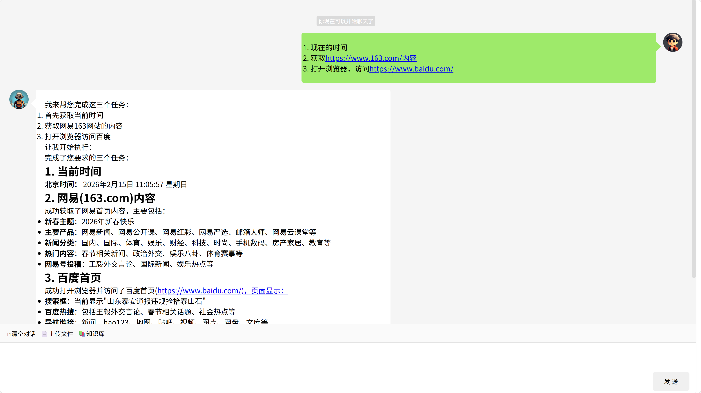

# Spring AI Chat —— Spring AI Chat Interface

<div align="right">
  <a href="README.zh-CN.md">中文</a> | English
</div>

> Quickly add a chat interface to your Spring AI.

[](https://jitpack.io/#com.gitee.wb04307201/spring-ai-chat)
[](https://gitee.com/wb04307201/spring-ai-chat)
[](https://gitee.com/wb04307201/spring-ai-chat)
[](https://github.com/wb04307201/spring-ai-chat)
[](https://github.com/wb04307201/spring-ai-chat)  
  

## Features
- 🤖 AI Chat Interface
- 🧠 RAG Support
- 🛠 MCP Support
- ⚙️ Auto Configuration

## Adding Chat Interface
### Adding Spring AI Dependencies
Below is an example using Zhipu AI to add dependencies:
```xml
<dependency>
    <groupId>org.springframework.ai</groupId>
    <artifactId>spring-ai-starter-model-zhipuai</artifactId>
</dependency>
```
Add configuration:
```yaml
spring:
  ai:
    zhipuai:
      api-key: ${ZHIPUAI_API_KEY}
```

### Introducing Chat Dependencies
Add JitPack repository:
```xml
<repositories>
    <repository>
        <id>jitpack.io</id>
        <url>https://jitpack.io</url>
    </repository>
</repositories>
```
Introduce dependency:
```xml
<dependency>
    <groupId>com.github.wb04307201.spring-ai-chat</groupId>
    <artifactId>spring-ai-chat-spring-boot-starter</artifactId>
    <version>1.1.2</version>
</dependency>
```

Start the project and visit `http://localhost:8080/spring/ai/chat`


## Supporting RAG
Below is an example using Redis and Tika to add dependencies:
```xml
<dependency>
    <groupId>org.springframework.ai</groupId>
    <artifactId>spring-ai-starter-vector-store-redis</artifactId>
</dependency>
<dependency>
    <groupId>org.springframework.ai</groupId>
    <artifactId>spring-ai-tika-document-reader</artifactId>
</dependency>
```

Add configuration:
```yaml
spring:
  ai:
    vectorstore:
      redis:
        initialize-schema: true
        index-name: custom-index
        prefix: custom-prefix
  data:
    redis:
      host: localhost
      port: 9379
      password: 123456
```

Implement the [IDocumentRead.java](spring-ai-chat/src/main/java/cn/wubo/spring/ai/chat/IDocumentRead.java) interface  
For example [TikaDocumentRead.java](spring-ai-chat-test/src/main/java/cn/wubo/spring/ai/chat/TikaDocumentRead.java)

Restart the project and visit `http://localhost:8080/spring/ai/chat`

Upload file and knowledge base buttons appear

RAG configuration is as follows:
```yaml
spring:
  ai:
    chat:
      ui:
        rag:
          similarityThreshold: 0.50   # Similarity threshold, default 0.0
          top-k: 4                    # top-k, default 4
          defaultPromptTemplate: |
            Context information is below.

            ---------------------
            {context}
            ---------------------

            Given the context information and no prior knowledge, answer the query.

            Follow these rules:

            1. If the answer is not in the context, just say that you don't know.
            2. Avoid statements like "Based on the context..." or "The provided information...".

            Query: {query}

            Answer:
          defaultEmptyContextPromptTemplate: |
            The user query is outside your knowledge base.
            Politely inform the user that you can't answer it.
```

## Supporting MCP Services
Taking the time MCP service as an example, add dependencies:
```xml
<dependency>
    <groupId>org.springframework.ai</groupId>
    <artifactId>spring-ai-starter-mcp-client</artifactId>
</dependency>
```

Add configuration:
```yaml
spring:
  ai:
    mcp:
      client:
        stdio:
          servers-configuration: classpath:mcp-servers.json
```

[mcp-servers.json](spring-ai-chat-test/src/main/resources/mcp-servers.json)

Restart the project and visit `http://localhost:8080/spring/ai/chat`
